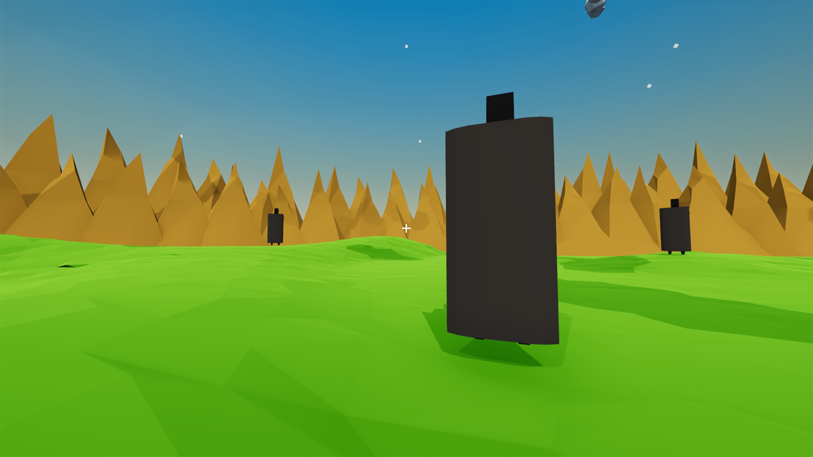
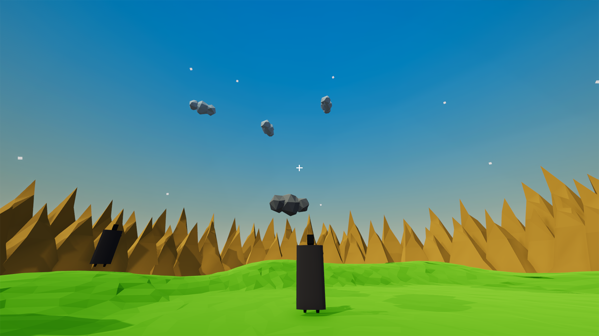

# DropCloud

To join [WeeklyGameJam63 "Watch The Sky"](https://itch.io/jam/weekly-game-jam-63).

## Idea

玩家操控美杜莎，有很多士兵来围剿美杜莎，玩家需要通过用眼睛看云朵的方法将云朵石化，让掉落下来的石头云朵砸死士兵。

## 游戏规则

3D，第一人称。

地图的形状为近圆形，地形为草原（程序生成平地后加上随机扰动），被山峰包围。地图上随机分布一定数量的树和石头。

士兵在游戏过程中产生，生成速度随游戏时长增大，生成的士兵随机分布在地图上，生成位置不能是美杜莎位置的一定范围内。首先出现一个魔法阵，然后士兵从里面钻出来。

士兵会直线向美杜莎走来，距离美杜莎一定距离时（近身距离），会发动攻击。

美杜莎要移动避开士兵的接触攻击（美杜莎速度快于士兵），同时要用眼睛石化云朵（用十字准星对准云朵），石化云朵需要视线不脱离云朵1s。

云朵会从地图外面向地图中心聚集，移动速度随距离减小而减小。

石头云朵掉下与士兵接触，士兵会死亡。死亡的士兵与石头之后消失。

美杜莎被士兵攻击即死亡。

当美杜莎死亡时，游戏结束，展示玩家的存活时间。

## 美术需求

低模。

低多边形模型。

- [x] 地图四周的山峰
- [x] 石头
- [x] 士兵
- [x] 云朵

动画

- [x] 士兵行走的动画
    - 0-12    start walk
    - 12-60   walk loop
- [x] 士兵盾击动画
    - 80-92

## 程序进度

- [x] 相机控制
    - [x] 旋转视角
- [x] 角色控制
    - [x] 移动
    - [x] 石化云朵
    - [x] 碰怪死亡
- [x] 地形生成
- [x] 敌人生成
- [x] 敌人ai
    - [x] 移动
    - [x] 被砸消失
- [x] 云朵生成
- [x] 云朵ai
    - [x] 移动
    - [x] 掉落消失
    - [x] 选中高亮
- [x] 游戏流程控制

## 音乐与音效

- [x] 游戏背景音
- [x] 石化音效
- [x] 云朵落地音效

## 截图

